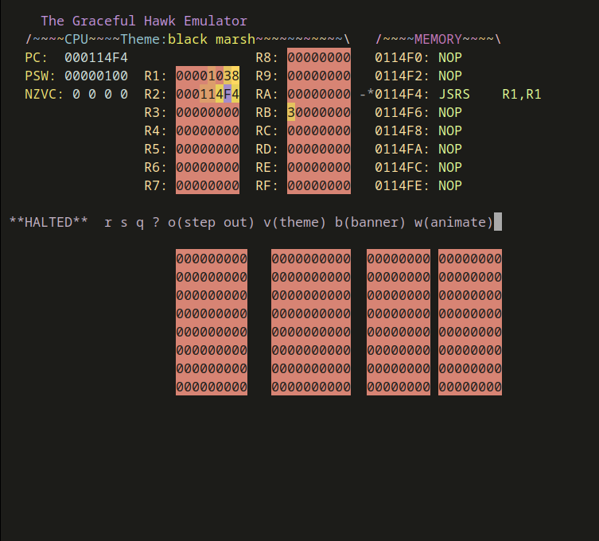

# Overview
This repository contains the **Graceful Hawk** emulator and **Ripple**.

**Graceful Hawk** is an extension of the Hawk emulator of the SMAL assembly language created by Dr. Douglas Jones of the University of Iowa.

**Ripple** generates and visualizes concentric wave patterns across a unified graphics display that spans the register panel, memory window, and monitor grid. Each wave is stored and rendered so that a hexadecimal digit encodes its height level. Pixels sharing the same hex value belong to the same wavefront. When two waves intersect, the crossing plane rises to a linear combination slightly below their total sum.

**Ripple** still works on the originalHawk emulator, but it looks much better on Graceful Hawk because each hex number is given a distinct color, giving the impression of undulation and depth. 


# How to Run
Clone the repo on a Linux distribution

```bash
cd graceful_hawk
bash mnt
```
```mnt``` is a bash script that runs **Ripple** in the **Graceful Hawk** emulator


Press `r` to run the program until the first break point ``JSRS   R1, R1`` 



Note that our program counter is now the data portion of the memory, which would be catastrophic under normal circumstances! However, the ``JSRS   R1,R1`` instruction that the PC points to was in fact dynamically stored here as its hex representation (afterall, data and instruction are both hexadecimal words at this level). This instruction is needed to get back into the main loop, but why did we come here? 

Well, the point is to use the hex words in memory as a way to display our ripples, and we must first suspend the memory display at this "anchor point". Simply press `t` to toggle the hex mode for memory


Since the memory display of the emulator does not follow the program counter in hex mode, the display is now anchored to our "canvas" in the memory, on which we can draw our ripples!

Simply press `w` to start the animation!

(Note that ```B1F1``` or equivalently ``JSRS   R1,R1`` must never be overwritten so that the program can continue the loop)


---

# Graceful Hawk

**Graceful Hawk** extends the base Hawk emulator into a fully animated, color-themed, and dynamically reactive terminal environment. It replaces the static monochrome interface with a modular theming engine, animated banners, and real-time color modulation synchronized with the emulator's internal state.

Most of the functionalities are implemented in C (`graceful_hawk.c` / `graceful_hawk.h`) but I also modified the display loop in `console.c`.


## Core Features

### 1. Runtime Theme Management

Maintains a global theme struct that defines RGB color sets for interface components (title, registers, memory, menu, CPU line, etc.).

**Supports multiple themes:**

- **t_default** – balanced blue/purple base
- **t_desert** – golden, warm palette
- **t_ocean** – cool blue-green palette
- **t_meadows** – fresh green-turquoise palette
- **t_crimson** – deep red-violet palette

**Each theme defines:**

- Fixed colors for interface elements
- Gradients for "colorful number" visualization (`n_mod0` … `n_mod3`)

**Major functions:**

- `init_themes_and_color_pairs()` – initializes all color pairs and sets the default theme
- `change_theme(int theme)` – switches between themes (cyclic or explicit)
- `start_theme(int t)` – applies the RGB definitions to curses color pairs

### 2. Animated Banners

Graceful Hawk includes an animated banner system rendered across the terminal header. Each banner can cycle colors and characters to simulate flowing gradients or alternating symbols.

**Banner modes:**

- **bs_disco** – shifting, saturated colors with flashing `$` / `\` characters
- **bs_gradient** – smooth color blending across tints and hues (`~` / `\`)
- **bs_alternating** – structured two-tone pulses using vertical bars (`|` `-` `-`)

**Major functions:**

- `set_banner_style(int incre)` – changes the current banner mode and re-initializes its colors
- `set_banner_colors()` – animates the banner by rotating its color indices each frame

### 3. Colorful Number Rendering

Registers, memory cells, and monitor digits can be displayed as color-coded hexadecimal values using gradient palettes that emphasize visual contrast.

Each 4-bit nibble (0–F) is mapped to a dynamic color pair, interpolated through the current theme's modulation vectors.

### 4. Dynamic Modulation

Each theme includes RGB modulation factors (`mr`, `mg`, `mb`) that control how other visual systems (e.g., ripple rendering) inherit the active color profile. The color modulation affects banner gradients, numeric visualization, and cross-fade animations.

---

# Ripple

**Ripple** is a simulation written in the SMAL32 assembly language. It generates, evolves, and visualizes concentric wave patterns across three synchronized display regions: the register panel, memory window, and monitor grid.


---

## System Architecture

### 1. Main Control Loop

**File:** `main.a`

Defines the top-level program cycle:

```assembly
PROGRAM_CYCLE:
    TOSUBR LOWER_CANVAS_VALUES
    TOSUBR ADD_RIPPLE
    TOSUBR DRAW_OBJECTS
    TOSUBR CHANGE_DISPLAY
    TOSUBR DISPLAY_CANVAS
```

Each iteration performs a full frame update:

- Decay existing pixels
- Spawn new ripple objects
- Draw active ripples as circles
- Randomly change visual display mode or banner
- Project the updated canvas to the visible interface

Each iteration corresponds to a frame.

```assembly
	TOSUBR	ENTRY_FROM_MAIN
```
Note that this line positions the memory pointer at the point where the memory display starts. 

### 2. Ripple Object System

**File:** `ripple.a`

Defines the core data structure and behavior of each wave.

**Each ripple has:**

| Field | Meaning | Example Range |
|-------|---------|---------------|
| `RIPPLE_X`, `RIPPLE_Y` | Position (relative to center) | −20–11, −9–7 |
| `RIPPLE_RAD` | Current radius | Starts at 1, grows each frame |
| `RIPPLE_WIDTH` | Line thickness | Constant = 3 |
| `RIPPLE_LIFE` | Lifespan counter | Random 3–15 frames |

**Major functions:**

- `RIPPLE_CONSTRUCTOR()` – allocates and initializes a new ripple with randomized attributes
- `ADD_RIPPLE()` – probabilistically spawns a new ripple (3/8 chance per frame) and stores it in `RIPPLE_ARRAY`
- `DRAW_RIPPLE()` – expands and draws one ripple on the canvas, increasing radius and decreasing life each cycle; dead ripples are freed once their life counter reaches zero


### 3. Object Management Layer

**File:** `draw_objects.a`

Maintains the lifecycle of all active ripple objects.

**Major function:**

- `DRAW_OBJECTS()` – iterates through the global `RIPPLE_ARRAY`, calling `DRAW_RIPPLE()` for each entry
  - If a ripple is alive → it is drawn
  - If a ripple has expired → its memory is freed and slot cleared


### 4. Geometric Rendering

**File:** `generate_circle.a`
Generates the coordinates and then modifies the relevant words in the canvas. 

**Major functions:**

- `GENERATE_CIRCLE_WITH_DUPES()` – computes all (x, y) points along a circle's perimeter given a radius and center
- `GENERATE_CIRCLE()` – filters duplicate coordinates from the above routine
- `DRAW_CIRCLE()` – converts each coordinate pair into a character (e.g., `#`, `~`) and sends it to the canvas via `DRAW_ON_CANVAS()`


### 5. Canvas Engine

**File:** `canvas.a`

Defines the in-memory two-dimensional word-based canvas buffer. Having the canvas means that any function can directly draw on it with a function call, whose details are abstracted by the DRAW_ON_CANVAS() method

**Major functions:**

- `INIT_CANVAS()` – allocates the multi-section canvas:
  - Upper region → registers
  - Middle → memory
  - Lower → monitor
- `DRAW_ON_CANVAS()` – dispatches pixel writes to the correct section (register, memory, or monitor)
- `SET_DIG_IN_WORD()` – handles sub-word pixel placement inside 4-bit "digit slots"
- `LOWER_CANVAS_VALUES()` – decays every value by halving it, creating fade-out trails

### 6. Display Reconstruction

**File:** `display.a`

Handles translation from the internal canvas to the unified emulator output.

**Major functions:**

- `RECREATE_MONITOR()` – prints the lower display (ripple grid) using canvas
- `RECREATE_MEMORY()` – writes relevant section from canvas into the right-side "memory" columns
- `RECREATE_REGISTERS()` – writes into upper-left "registers"
  
- `DISPLAY_CANVAS()` – runs the three above

Together, these reset the displays and 

---

## Simulation Loop Summary

| Step | Function | Description |
|------|----------|-------------|
| 1 | `LOWER_CANVAS_VALUES` | Fade previous frame |
| 2 | `ADD_RIPPLE` | Possibly spawn new ripple |
| 3 | `DRAW_OBJECTS` | Draw all active ripples |
| 4 | `DISPLAY_CANVAS` | Redraw monitor, memory, and registers |
